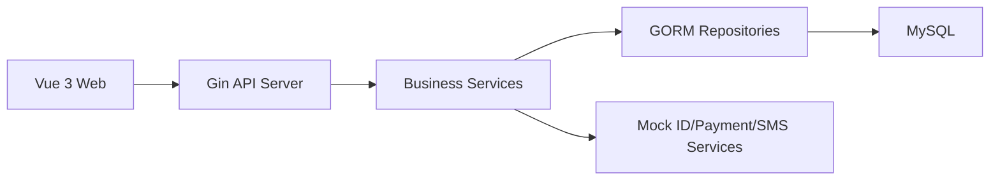

# 架构与技术栈约束

## 1. 总体架构

项目采用前后端分离架构：

- Web 前端负责页面渲染、表单校验、登录态展示、用户交互和调用后端 API。
- Go 后端负责认证、权限、业务规则、事务、库存、支付模拟、数据持久化。
- MySQL 负责永久数据存储。
- 第三方服务以本地 mock 服务实现，由后端统一调用。



## 2. 推荐仓库结构

```text
mini-12306/
  AGENTS.md
  docs/
  backend/
    cmd/server/main.go
    internal/
      config/
      database/
      middleware/
      router/
      handler/
      service/
      repository/
      model/
      dto/
      validator/
    pkg/
      auth/
      response/
      errors/
      mock/
      logger/
      requestctx/
    migrations/
    tests/
    go.mod
  frontend/
    src/
      api/
      assets/
      components/
      composables/
      layouts/
      pages/
      router/
      stores/
      types/
      utils/
    index.html
    package.json
    tailwind.config.ts
  scripts/
  docker-compose.yml
  README.md
```

## 3. 后端分层

- `handler`：只处理 HTTP 入参、鉴权上下文、响应，不写核心业务逻辑。
- `service`：承载业务规则、状态机、事务边界、第三方模拟调用。
- `repository`：封装 GORM 查询和持久化，不决定业务状态流转。
- `model`：数据库模型，包含 GORM 标签和基础字段。
- `dto`：请求和响应结构，避免直接暴露数据库模型。
- `middleware`：JWT、日志、错误恢复、角色权限。
- `internal/database`：初始化 GORM MySQL 连接，并提供数据库健康检查能力。
- `pkg/response`：统一响应结构。
- `pkg/requestctx`：请求上下文通用键，如 `traceId`。
- `pkg/errors`：业务错误码和错误转换。

## 4. 前端分层

- `pages`：路由级页面，如登录、注册、车次查询、订单、车票、管理后台。
- `components`：可复用 UI 组件，不直接写业务请求。
- `api`：Axios 实例和接口函数，统一处理 token、错误和响应结构。
- `stores`：Pinia 状态，如用户、站点缓存、查询条件。
- `types`：接口类型和领域类型，尽量与后端 DTO 对齐。
- `router`：路由守卫，处理登录和角色权限。
- `composables`：复用交互逻辑，如分页、请求状态、表单状态。

## 5. API 设计约束

- API 统一前缀：`/api/v1`。
- 统一 JSON 响应：

```json
{
  "code": "OK",
  "message": "success",
  "data": {},
  "traceId": "req_xxx"
}
```

- 分页响应统一包含 `items`、`page`、`pageSize`、`total`。
- 写操作需要考虑幂等键，支付、退票、改签必须有幂等处理。
- 不把数据库错误、SQL 细节或堆栈返回给前端。

## 6. 鉴权与权限

- 登录成功返回 access token；课程 MVP 可暂不做 refresh token。
- 前端将 token 放在内存或 Pinia 持久化方案中，API 客户端统一附加 `Authorization: Bearer <token>`。
- 后端从 JWT 中解析用户 ID 和角色，并注入 Gin context。
- 管理接口必须检查 `ADMIN` 角色。

## 7. 数据库与迁移

- 使用 MySQL 8.x。
- 推荐使用显式 SQL 迁移文件或迁移工具，避免在正式演示环境完全依赖 `AutoMigrate`。
- 表字段使用 `snake_case`。
- 主键可使用 `BIGINT AUTO_INCREMENT` 或 UUID；同一项目内保持统一。
- 高频查询必须建立索引：车次查询、用户登录、订单列表、车票列表。

## 8. 事务边界

以下操作必须在事务中完成：

- 创建订单并锁定库存。
- 支付成功并出票。
- 取消订单并释放库存。
- 退票并释放库存、创建退款。
- 改签并处理原票、新票、库存、差价。

事务逻辑放在 service 层，不放在 handler 或前端。

## 9. 配置与环境

后端通过环境变量或 `.env` 管理：

- `APP_ENV`
- `APP_PORT`
- `MYSQL_DSN`
- `JWT_SECRET`
- `TOKEN_EXPIRE_MINUTES`
- `ORDER_PAY_EXPIRE_MINUTES`

后端启动时必须提供 `MYSQL_DSN`，并且必须能成功连接 MySQL；缺失 DSN 或连接失败时服务直接启动失败。

前端通过 Vite 环境变量管理：

- `VITE_API_BASE_URL`
- `VITE_API_PROXY_TARGET`

开发环境跨域通过 Vite dev server proxy 转发 `/api` 到后端服务，后端不启用 CORS 中间件。

不要把真实密钥提交到仓库。
